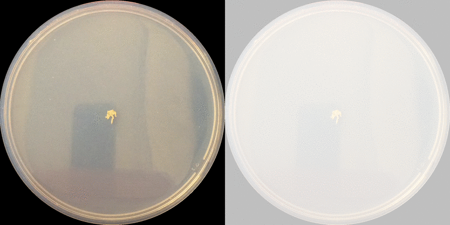

# Blob-tracking for larva movement assays

1. ## Purpose

    

    Output includes detailed tables of speed and distance traveled at specific times.

1. ## [Setup](SETUP.md)

1. ## [Usage tutorial](USAGE.md)

1. ## [Issues, limitations, and wishlist](TODO.md)

1. ## [Changes](CHANGELOG.md)

### Colors

The colors of the larva paths used in the debug image come from [wikipedia's distinguishable colors](https://en.wikipedia.org/wiki/Help:Distinguishable_colors) from the *Colour Alphabet Project* which resemble [Kelly's 22 color set [pdf]](https://eleanormaclure.files.wordpress.com/2011/03/colour-coding.pdf).
