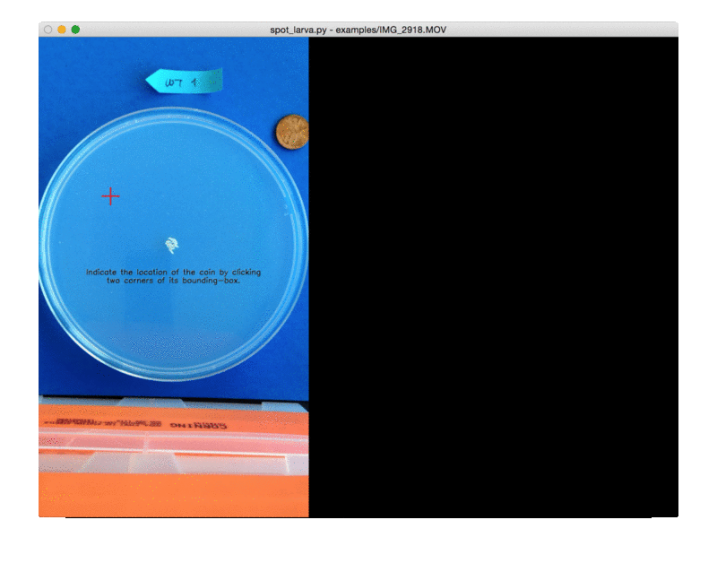
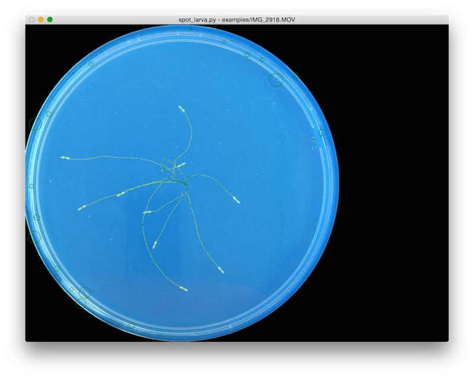

# Usage

The `spot_larva.py` program has a fairly comprehensive set of documented
arguments. View them with the shell command:

```sh-session
$ ./spot_larva.py --help
```

1. ### Todo

    * describe debugging of tracking
    * describe output format(s)
    * describe helper programs

1. ### Brief Tutorial

    1. Run the spot_larva program with commands at your shell interpreter (eg.
       `bash`, wherein the command excludes the `$ ` at the beginning).

        ```sh-session
        $ ./spot_larva.py --window-height 700 examples/IMG_2918.MOV
        ```

        * This command runs the tracking algorithm on the example data included
          in this repository with a 700px tall diagnostic output window
          (*OpenCV 2.4* on Mac doesn't properly detect the screen height).

        * The program will detect and use the size of the petri dish in the
          frame to scale the data. It assumes a 15mm petri dish. If the petri
          dish in your video is not 15mm in diameter, use the
          `-p/--petri-dish-diameter` option to set the correct size.

            * The petri dish must be between 80-120% of the narrow-dimension of
              the video frame.

    1. The diagnostic window will request that you "circle the coin" in the
       video frame to assist in scaling the data accurately.

        * *If you have no coin in your video frame, press the `ESC` key to
          quit. Then run the program with the `--no-coin` option to skip this
          step.*

        * To circle the coin, click twice (once at each corner of the
          bounding-box around the coin). Try to make the green circle match the
          coin, but it's not necessary to be accurate. The yellow circles
          indicate the minimum and maximum allowed detection radius (50-140% of
          the yellow square).

            

        * The coin bounding box is cached in a file at
          `examples/IMG_2918.coin.npy` so that you don't have to select it
          every time you run the analysis. If you'd like to select it again,
          just move or delete that file.

        * The coin is assumed to be a 19.05 mm US penny. Use the
          `-c/--coin-diameter` option if you'd like to use a coin of a
          different size.

    1. The tracking program proceeds by itself. *Press the `ESC` key to quit.*

        1. Detect the coin size (no visual feedback). Add `--debug coin` to see
           visual feedback for this stage.

        1. Detect the petri-dish size (no visual feedback). Add `--debug petri`
           to see visual feedback for this stage.

        1. Detect larva blobs in each frame, and map them to the subsequent
           frame using optical flow; Paths are drawn as they are detected.

            

1. ### Arguments in depth

    This section contains notes on why each of the current options exists.

    ```sh-session
    $ ./spot_larva.py --help
    usage: spot_larva.py [-h] [-b i] [-e j] [-c mm] [-p mm] [-f f]
                         [-d stage] [--no-coin] [-wh px] movie

    positional arguments:
      movie                 The path to the movie file to perform image
                            tracking on.

    optional arguments:
      -h, --help            show this help message and exit
    ```

    1. #### Usability
        ```sh-session
          -wh px, --window-height px
                                Resize the window to a 4:3 landscape with
                                this height. Default behavior is operating
                                system dependent (Linux fits the screen,
                                OSX doesn't).
        ```
        On Mac OSX OpenCV doesn't resize the window to fit my screen. Use
        this to constrain window height (width will follow).

    1. #### Frame slicing
        ```sh-session
          -b i, --beginning i   First frame to perform analysis on.
                                (default: first frame, 0)
          -e j, --ending j      Last frame to perform analysis on.
                                (default: last frame, dependent on the
                                video)
        ```
        The `-b` and `-e` options exist to cut out the extra parts of
        videos that contain too much frame jitter or irrelevant content at
        the ends.

    1. #### Millimeter calibration
        ```sh-session
          -c mm, --coin-diameter mm
                                Diameter of the coin in the frame in
                                millimeters. (default: size of a US penny)
          -p mm, --petri-dish-diameter mm
                                Diameter of the petri dish in the frame in
                                millimeters. (default: 15mm)
        ```
        The `-c` and `-p` options allow calibration of px/mm by detecting
        circles of known diameter in the frame of video. If your petri dish
        or reference coin don't match these defaults, you must provide
        these options to obtain correct data.
        ```sh-session
          --no-coin             If there is no coin in the movie, give this
                                option to skip searching for one (and rely
                                solely on petri-dish size).
        ```
        In case no coin was included in the video, pass `--no-coin` to skip
        the phase asking for the "area of interest" around the coin.

    1. #### Path filtering
        ```sh-session
          -f f, --max-flow-fraction f
                                Allowed portion of a path which is
                                optical-flow. (default: 0.4)
        ```
        The `-f` option adjusts which paths are filtered on-the-fly. Paths
        are filtered when they consist of a high proportion of flow-nodes
        (meaning, a blob wasn't detected and optical-flow was used to
        extend the path).

        * If you notice larva paths with red sections are being filtered or
          broken, increase this value.
        * If you notice video-noise artifact paths are being included,
          decrease this value.

    1. #### Debugging of detection, tracking, or code
        ```sh-session
          -d stage, --debug stage
                                To debug the system, give the name of a
                                failing stage based on errors or warnings.
        ```
        Some errors and warnings will output the name of their debug-stage.
        This option takes that name and provides an extra window with debug
        information, as well as verbose textual output, during that stage.
